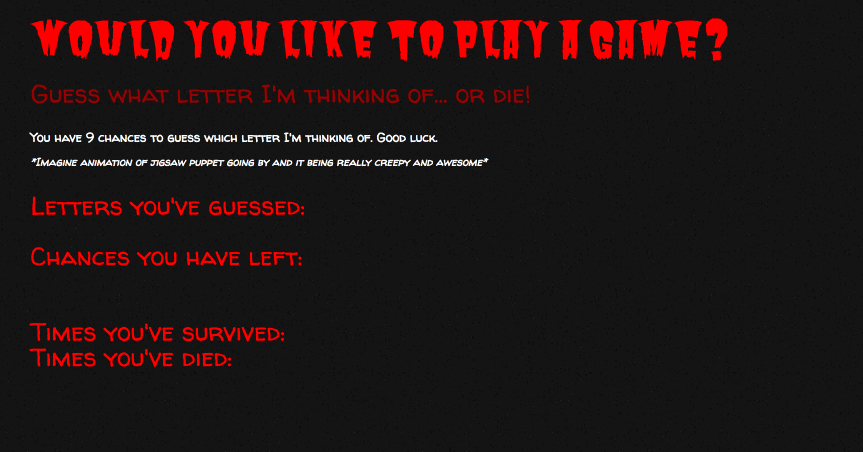

<h1 align="center">Psychic-Game</h1>

JavaScript game to try and beat the computer, and test out psychic abilities.

## Deployed Application

[GitHub Pages] <https://g33klaura.github.io/Psychic-Game/>

## Inspiration/ Concept

As a fan of the horror movie genre, I thought it'd be fun to put a creep-inducing spin on my first JavaScript game. There are visual elements I still need to work out, but I very much enjoyed building this application with an underlying story in mind.

## Technologies Used

Vanilla JavaScript, CSS, HTML

## Key Features

* Keeps running score
* Alert to user if non-letter key is pressed

### Application Process

1. You're attempting to guess the letter chosen by the computer
1. Press letters on the keyboard to guess the letter
1. You have 9 chances to guess the correct letter
1. If the correct letter is guessed, an alert will display and your "survived" score will increase
1. If you run out of guesses, an alert will display and your "died" score will increase
1. After each round, the letter guessed by the computer will display at the bottom of the page

### Screenshots

###### Game process

*Good luck!*